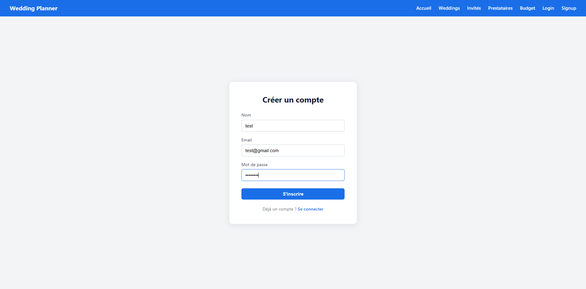
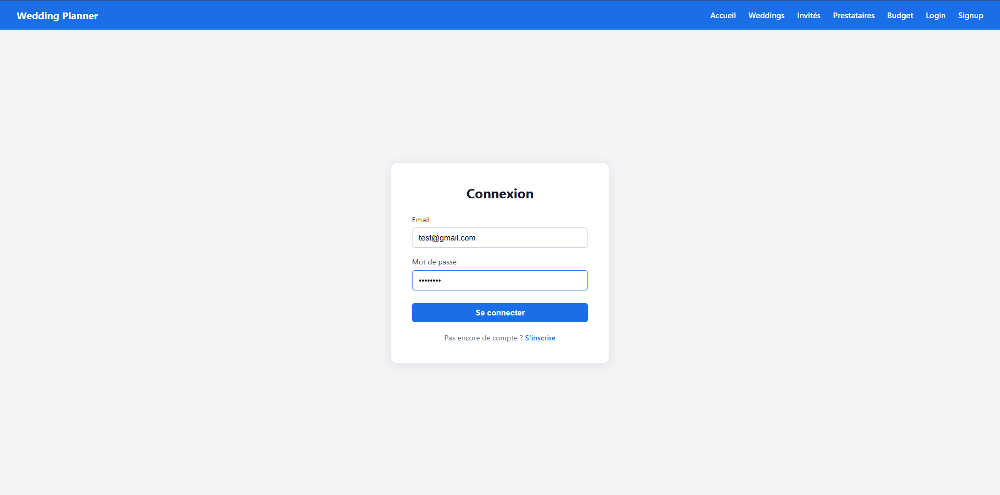
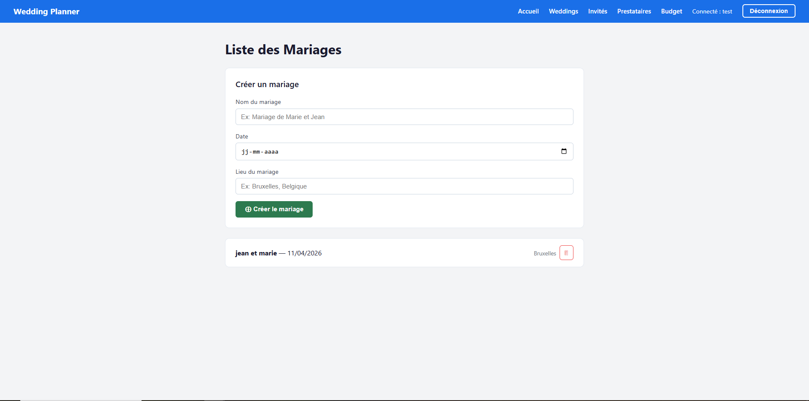
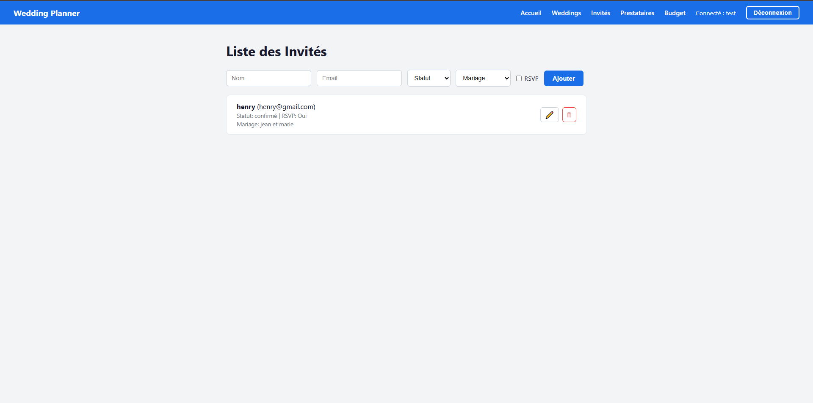
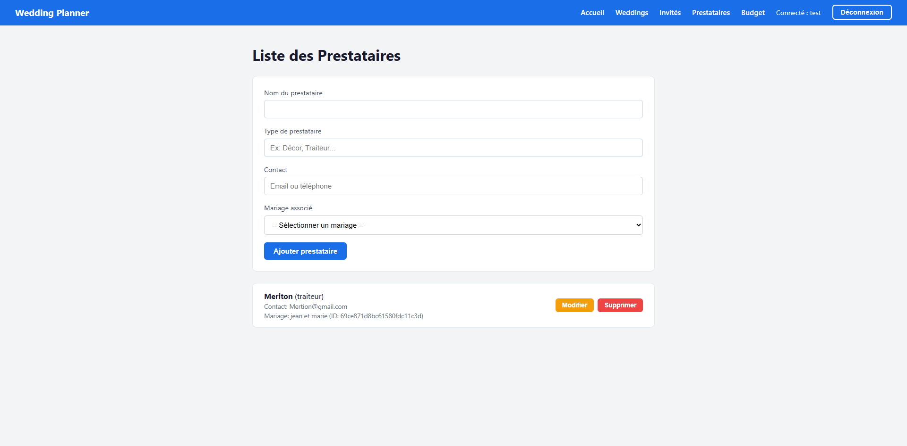
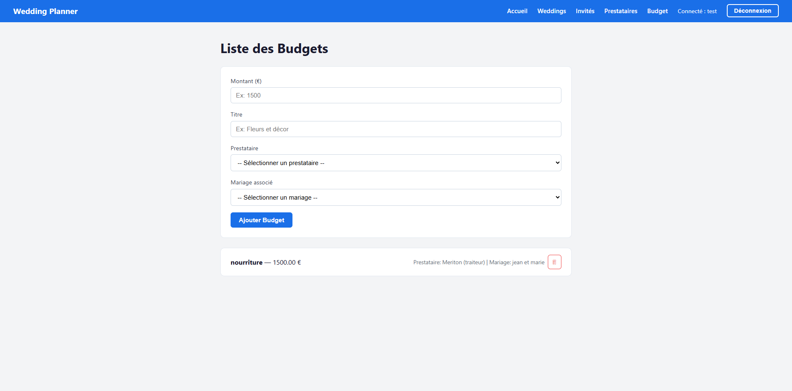
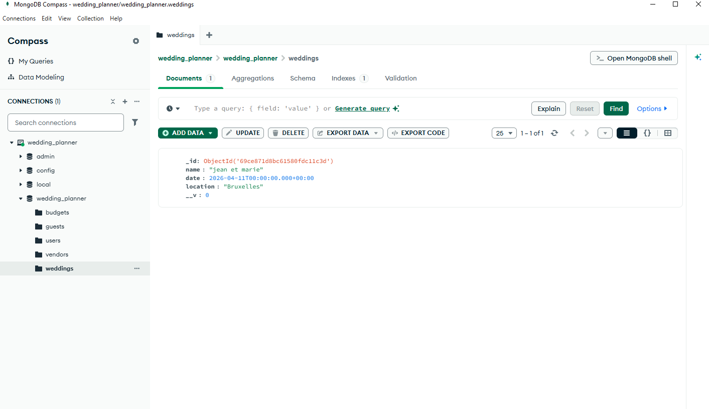

# Wedding Planner

Une application web fullstack permettant aux organisateurs de mariage de gérer leurs événements, invités, prestataires et budgets.

---

## Objectif du projet

Permettre à chaque organisateur de créer un compte personnel et de gérer de façon isolée :
- Ses **mariages** (nom, date, lieu)
- Ses **invités** (statut, RSVP, mariage associé)
- Ses **prestataires** (type, contact, mariage associé)
- Son **budget** (montant, prestataire et mariage associés)

---

## Technologies utilisées

### Backend
| Technologie | Rôle |
|-------------|------|
| Node.js | Environnement d'exécution JavaScript |
| Express.js | Framework web pour les routes API |
| MongoDB | Base de données NoSQL |
| Mongoose | ODM pour modéliser les données MongoDB |
| bcryptjs | Hashage des mots de passe |
| jsonwebtoken | Authentification via tokens JWT |
| dotenv | Gestion des variables d'environnement |
| cors | Autoriser les requêtes cross-origin |

### Frontend
| Technologie | Rôle |
|-------------|------|
| React | Interface utilisateur |
| React Router DOM | Navigation entre les pages |
| Context API | Gestion de l'état d'authentification global |
| Fetch API | Communication avec le backend |

---

## Structure du projet

```
WeddingPlanner/
├── wedding_planner/          ← Backend
│   ├── models/
│   │   ├── User.js
│   │   ├── Wedding.js
│   │   ├── Guest.js
│   │   ├── Vendor.js
│   │   └── Budget.js
│   ├── routes/
│   │   ├── authRoutes.js
│   │   ├── weddingRoutes.js
│   │   ├── guestRoutes.js
│   │   ├── vendorRoutes.js
│   │   └── budgetRoutes.js
│   ├── middleware/
│   │   └── authMiddleware.js
│   ├── .env
│   └── server.js
│
└── frontend/                 ← Frontend
    └── src/
        ├── components/
        │   ├── Navbar.js
        │   └── PrivateRoute.js
        ├── context/
        │   └── AuthContext.js
        ├── pages/
        │   ├── Home.js
        │   ├── Login.js
        │   ├── Signup.js
        │   ├── Weddings.js
        │   ├── Guests.js
        │   ├── Vendors.js
        │   └── Budget.js
        ├── api.js
        └── App.js
```

---

## Installation

### Prérequis
- [Node.js](https://nodejs.org/) v18+
- [MongoDB](https://www.mongodb.com/) (local via MongoDB Compass ou Atlas)
- [Git](https://git-scm.com/)

### 1. Cloner le projet

```bash
git clone https://github.com/ton-username/wedding-planner.git
cd wedding-planner
```

### 2. Installer les dépendances backend

```bash
cd wedding_planner
npm install
```

### 3. Installer les dépendances frontend

```bash
cd ../frontend
npm install
```

---

## Configuration des fichiers .env

Crée un fichier `.env` dans le dossier `wedding_planner/` :

```env
MONGO_URI=mongodb://localhost:27017/wedding_planner
PORT=5000
JWT_SECRET=weddingplanner_secret_key_2024
```


---

## Lancer le projet

Tu as besoin de **3 terminaux** ouverts simultanément :

### Terminal 1 — Démarrer MongoDB
```bash
mongod
```

### Terminal 2 — Démarrer le backend
```bash
cd wedding_planner
node server.js
```

Tu dois voir :
```
MongoDB connecté
Serveur lancé sur le port 5000
```

### Terminal 3 — Démarrer le frontend
```bash
cd frontend
npm start
```

L'application s'ouvre automatiquement sur **http://localhost:3000**

---

## Routes principales de l'API

### Authentification
| Méthode | Route | Description |
|---------|-------|-------------|
| POST | `/api/auth/register` | Créer un compte |
| POST | `/api/auth/login` | Se connecter |

### Mariages (protégées par JWT)
| Méthode | Route | Description |
|---------|-------|-------------|
| GET | `/api/weddings` | Récupérer tous les mariages |
| POST | `/api/weddings` | Créer un mariage |
| PUT | `/api/weddings/:id` | Modifier un mariage |
| DELETE | `/api/weddings/:id` | Supprimer un mariage |

### Invités (protégées par JWT)
| Méthode | Route | Description |
|---------|-------|-------------|
| GET | `/api/guests` | Récupérer tous les invités |
| POST | `/api/guests` | Ajouter un invité |
| PUT | `/api/guests/:id` | Modifier un invité |
| DELETE | `/api/guests/:id` | Supprimer un invité |

### Prestataires (protégées par JWT)
| Méthode | Route | Description |
|---------|-------|-------------|
| GET | `/api/vendors` | Récupérer tous les prestataires |
| POST | `/api/vendors` | Ajouter un prestataire |
| PUT | `/api/vendors/:id` | Modifier un prestataire |
| DELETE | `/api/vendors/:id` | Supprimer un prestataire |

### Budgets (protégées par JWT)
| Méthode | Route | Description |
|---------|-------|-------------|
| GET | `/api/budgets` | Récupérer tous les budgets |
| POST | `/api/budgets` | Ajouter une entrée budget |
| DELETE | `/api/budgets/:id` | Supprimer une entrée budget |


## Fonctionnement global

### Architecture

```
Navigateur (React)
      ↕ HTTP + JWT
Backend (Express)
      ↕ Mongoose
MongoDB (Base de données)
```

### Flux d'authentification

1. L'utilisateur s'inscrit via `/api/auth/register`
2. Le mot de passe est **hashé avec bcryptjs** avant d'être stocké
3. Le backend génère un **token JWT** signé avec `JWT_SECRET`
4. Le frontend stocke ce token dans `localStorage`
5. Chaque requête suivante envoie ce token dans le header `Authorization`
6. Le middleware `authMiddleware.js` vérifie le token avant chaque route protégée

### Isolation des données

Chaque document (mariage, invité, prestataire, budget) contient un champ `userId`. Toutes les requêtes filtrent par `{ userId: req.user.id }`, garantissant qu'un utilisateur ne voit jamais les données d'un autre.

---

## Captures d'écran

### Page d'inscription


### Page de connexion


### Liste des mariages


### Ajout d'un invité


### Ajout d'un prestataire


### Ajout d'un budget


### MongoDB Compass


---

